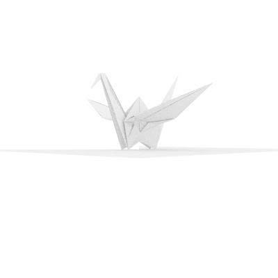

# Advanced Features
### 1. Multi-threading (5pts)
##### basic: Single-threaded per-pixel rendering
```
        for j in 0..height {
            for i in 0..self.width {
                let pixel_ij = pixel_00 + pixel_u * i as f64 + pixel_v * j as f64;
                let pixel = img.get_pixel_mut(i, j);

                let mut pixel_color = Vec3::new(0.0, 0.0, 0.0);
                for _sample_times in 0..self.samples_per_pixel {
                    let ray = Camera::get_ray(
                        pixel_ij,
                        &self.look_from,
                        pixel_u,
                        pixel_v,
                        defocus_disk_u,
                        defocus_disk_v,
                    );
                    pixel_color = pixel_color + self.ray_color(&ray, world, self.max_depth);
                }
                pixel_color = pixel_color / self.samples_per_pixel as f64;
                let color_interval = Interval::new(0.0, 1.0);
                pixel_color.x = color_interval.clamp(pixel_color.x);
                pixel_color.y = color_interval.clamp(pixel_color.y);
                pixel_color.z = color_interval.clamp(pixel_color.z);

                pixel_color = Camera::linear_to_gamma(pixel_color);
                pixel_color = pixel_color * 255.0;
                *pixel = pixel_color.to_rgb();
            }
            progress.inc(1);
        }
        progress.finish();
```
##### modified: 8-thread row-blocked multi-threaded rendering
```
        let mut handles = vec![]; // 句柄
        let number_of_thread = 8;
        for i in 0..number_of_thread {
            let start_line = i * height / number_of_thread; // 起始行
            let mut end_line = (i + 1) * height / number_of_thread; // 终止行
            if i == number_of_thread - 1 {
                end_line = height;
            } 
            // 最后一个线程要把剩下的行全部包括
            
            let thread_world = Arc::clone(&world); 
            // 支持并发的原子指针（项目中原来所有的Rc全部改成Arc）
            
            let thread_camera = self.clone();
            // 传入时render的函数签名改为
            // pub fn render(self: Arc<Self>, world: Arc<HittableList>)
            
            // 开一个新线程
            // 先把每个像素的color值存在vector中
            // 最后在主线程中一起写入 避免引入锁
            let handle = thread::spawn(move || {
                let mut local_rows = vec![];
                for i in start_line..end_line {
                    let mut row_colors = vec![];
                    for j in 0..thread_camera.width {
                        let pixel_ij = pixel_00 + pixel_u * i as f64 + pixel_v * j as f64;

                        let mut pixel_color = Vec3::new(0.0, 0.0, 0.0);
                        for _sample_times in 0..thread_camera.samples_per_pixel {
                            let ray = Camera::get_ray(
                                pixel_ij,
                                &thread_camera.look_from,
                                pixel_u,
                                pixel_v,
                                defocus_disk_u,
                                defocus_disk_v,
                            );
                            pixel_color = pixel_color + thread_camera.ray_color(&ray, &thread_world, thread_camera.max_depth);
                        }
                        pixel_color = pixel_color / thread_camera.samples_per_pixel as f64;
                        let color_interval = Interval::new(0.0, 1.0);
                        pixel_color.x = color_interval.clamp(pixel_color.x);
                        pixel_color.y = color_interval.clamp(pixel_color.y);
                        pixel_color.z = color_interval.clamp(pixel_color.z);
                        pixel_color = Camera::linear_to_gamma(pixel_color);
                        pixel_color = pixel_color * 255.0;
                        row_colors.push(pixel_color.to_rgb());
                    }
                    local_rows.push((i,row_colors));
                }
                local_rows
            });
            handles.push(handle);
        }
        for handle in handles {
            let rendered_rows = handle.join().unwrap();
            for (x,row) in rendered_rows {
                for y in 0..self.width {
                    *img.get_pixel_mut(x, y) = row[y as usize];
                    progress.inc(1);
                }
            }
        }
        progress.finish();
```
#### Performance
Take rendering of the ending scene in book2 as an example.
##### Settings:
width = 800,\
samples_per_pixel = 250,\
camera_max_depth = 40;\
use BVH optimization

Single-threaded: 
11min13s\
Multi-threaded(8-threaded):
3min\
Acceleration: 3.7 times faster

### 2. Support for Model Loading (5pts)
Support 3D model file (.obj) loading
```
    // 读取命令行数据 支持多个模型
    let obj_files: Vec<String> = std::env::args().skip(1).collect();

    for obj_file in obj_files {
        // 加载.obj文件
        let (models, _materials) = tobj::load_obj(&obj_file, &tobj::LoadOptions::default())
            .expect("Failed to OBJ load file");

        for m in models.iter() {
            let mesh = &m.mesh;
            let mut next_face = 0;
            for face in 0..mesh.face_arities.len() {
                let end = next_face + mesh.face_arities[face] as usize;

                let face_indices = &mesh.indices[next_face..end];

                if face_indices.len() >= 3 {
                    let point0 = Vec3::new(
                        mesh.positions[(face_indices[0] * 3) as usize] as f64,
                        mesh.positions[(face_indices[0] * 3 + 1) as usize] as f64,
                        mesh.positions[(face_indices[0] * 3 + 2) as usize] as f64,
                    );
                    let point1 = Vec3::new(
                        mesh.positions[(face_indices[1] * 3) as usize] as f64,
                        mesh.positions[(face_indices[1] * 3 + 1) as usize] as f64,
                        mesh.positions[(face_indices[1] * 3 + 2) as usize] as f64,
                    );
                    let point2 = Vec3::new(
                        mesh.positions[(face_indices[2] * 3) as usize] as f64,
                        mesh.positions[(face_indices[2] * 3 + 1) as usize] as f64,
                        mesh.positions[(face_indices[2] * 3 + 2) as usize] as f64,
                    );
                    world.add(Arc::new(Triangle::new(
                        point0,
                        point1 - point0,
                        point2 - point0,
                        Arc::new(Lambertian {
                            texture: Arc::new(SolidColor::new(Vec3::new(0.9, 0.9, 0.9))),
                        }),
                    )));

                    if face_indices.len() == 4 {
                        let point3 = Vec3::new(
                            mesh.positions[(face_indices[3] * 3) as usize] as f64,
                            mesh.positions[(face_indices[3] * 3 + 1) as usize] as f64,
                            mesh.positions[(face_indices[3] * 3 + 2) as usize] as f64,
                        );
                        world.add(Arc::new(Triangle::new(
                            point3,
                            point1 - point3,
                            point2 - point3,
                            Arc::new(Lambertian {
                                texture: Arc::new(SolidColor::new(Vec3::new(0.9, 0.9, 0.9))),
                            }),
                        )));
                    }
                }
                next_face = end;
            }
        }
    }
```
##### Example of importing and rendering a 3D paper crane.
